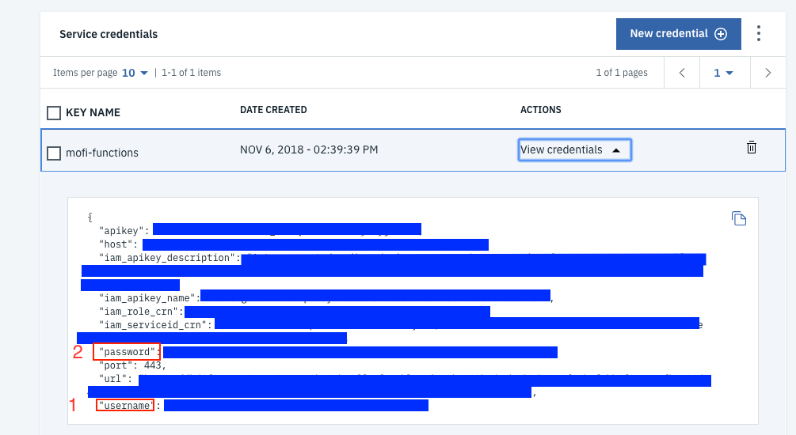

# Create Data Function
For this we need to have a dependency of cloudant. So check back on [previous docs](./Basics.md) on how to create action with dependency.

Here is the step by step guide
1. Create a new folder. Give it any name
2. In the folder create a new js file.
3. `npm init` Keep the defaults.
4. `npm install --save @cloudant/cloudant` To get cloudant module in packag.json
5. `npm install`
6. Write our function code.
7. `zip -r <name>.zip *`
8. Provision a `cloudant-db` by finding `cloudant` from the catalog in ibmcloud

9. Give it a new name, for auth method select `use both legacy credentials and IAM`, choose the `lite` plan and hit create.

10. Once the service is provisioned, Go to service credentials.

11. Click on new Credentials.
12. Give it a name

13. Click on `view credentials`

14. You can ignore everything else. Just take note of the `username` and `password`

15. We will set these as default param in our functions.
16. `wsk action create <action> --kind nodejs:default <name>.zip` 
`<action> -p username "<cloudant-user>" -p password "<clouandt-password>"` is the name of the action you give. I named mine `create-data`. 

Here is the code
Its also available here [CODE](./functions/create-data)

###create.js
```javascript
var Cloudant = require('@cloudant/cloudant');

function create(params) {
  var username = params.username;
  var password = params.password;
  var cloudant = Cloudant({account:username, password:password});

  console.log("v0.0.2");
  return new Promise(function(resolve, reject){
    cloudant.db.list(function(err, body, headers){
      if(err) {
        console.log("Database Connection Failure");
        reject({error: "Database Failure"});
      }

      if(!body.includes('workshop')) {
        cloudant.db.create('workshop', function(){
          console.log('Created Database for first time use');
        });
      }
    });
  
    var database = cloudant.db.use('workshop');
    var store = {};
    var date = new Date();
    store.from = params.From;
    store.time = date.getTime();
    if(params.NumMedia !== "0" && params.MediaContentType0 === "image/jpeg") {
      store.img = params.MediaUrl0;
    } else {
      var text = params.Body.split('\n');
      if(text.length !== 2) {
        console.log("Not Enough Info")
        reject({error: "Not Enough Info"});
      }
      var name = text[0].split(":").length === 2 ? text[0].split(":")[1].trim() : "Stranger";
      var hobby = text[1].split(":").length === 2 ? text[1].split(":")[1].trim() : "Nothing";
      store.name = name;
      store.hobby = hobby;
    }
  
    database.insert(store, function(err, body){
      if (err) {
        console.log("Insert error",err);
        reject({error: "Insert error"});
      }
      console.log("New Record Created");
      resolve({succes: "Succesfully Entered Data to DB"});
    });
  })
}

exports.main = create;
```

## Make it available
The action is created. But Twilio cant access it still.

1. From your cloud console open the side menu. You can open the side menu by clicking the hamburger.


2. Select `Functions`


3. Go to `Actions`

4. From the list of actions find `create-data` function and click it.

5. Go to `Endpoints`

6. Check enable as webaction and save. And make note of the public url. We will need that for twilio.


[Step 2 : Twilio Setup](./Twilio.md)