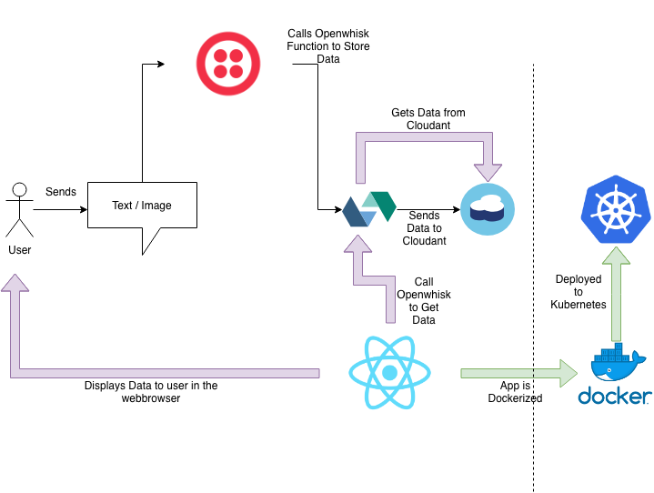

# Overview
The app we are building is fairly simple.

Users sends a message to a number, and the message will show up in a website. 

This is how the app works

We will have two openwhisk functions, one to get data stored to database, and one to get data from database. We will make twilio send the data from our user message to a openwhisk function, which will store the data to cloudant. 

From our react app side we will need another function that gets data from the cloudant database. 

Finally with time permitting we will look into dockerizing our app and having it run on kubernetes so anyone in the world can access it.

[Step 1 : Create Data](./Create-Data.md)