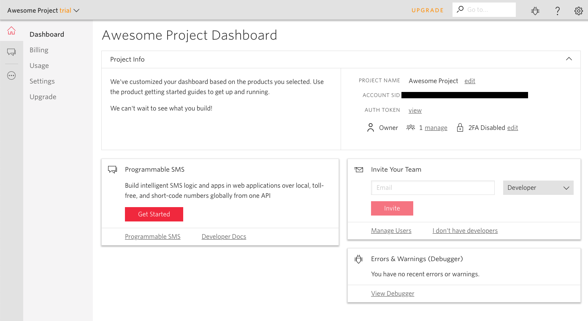

# Twilio Setup
If you dont know what twilio is, check out https://www.twilio.com/

With twilio you can easily send sms to users and take actions based on user messages. They have ton more features, find more here https://www.twilio.com/

But for our need we only need a trial account with a number, and we will make use of inbound message webhooks. 

https://www.twilio.com/docs/ Will give you more info on how you can make use of twilio. 

Once you are in you console, for first time users you would be asked to create a project. Create a project with Programmable SMS

Give your project a new Name

It will then ask you to invite a team mate, you can skip this step.

Your dashboard will look something like this.

Click on get started
Then Get a number

Then go to sms
Create a new Messaging Service

Give it any name and and for use case select anything, I just went with mixed. (I dont know what the different ones mean)

Check the proces inbound messages box. And paste the URL from our function here. Now Everytime there is a message sent to this number, a call to our function will be made. 

Save and We are done.

[Step 3 : Retrieve Data Function](./Retrieve-Data.md)